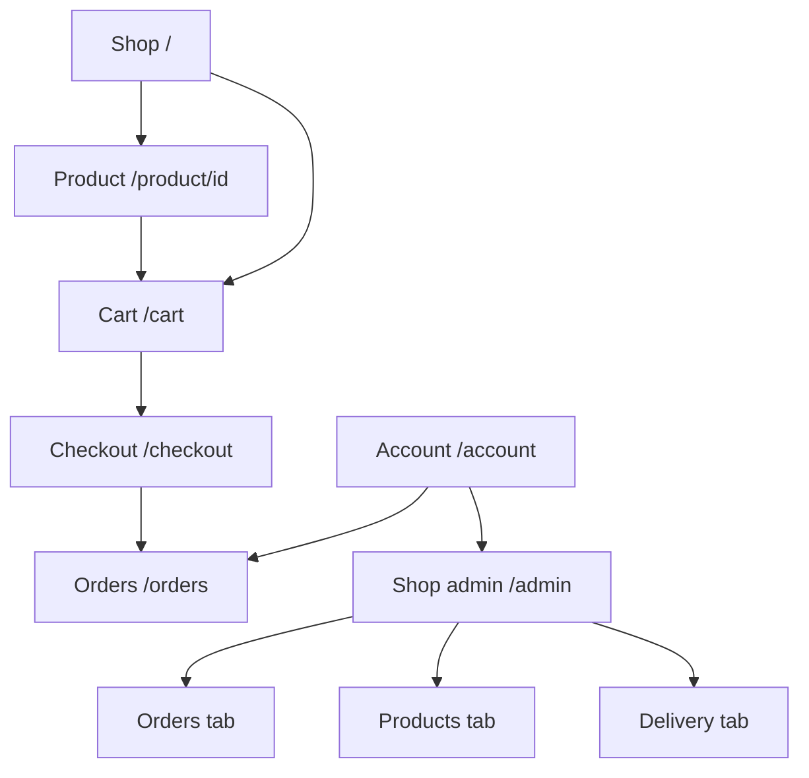
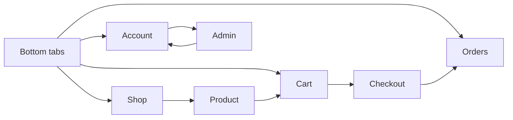

# Affordable Gold mobile information architecture

This document describes the Expo Router application in `mobile/src/app/`. The mobile app serves shoppers, signed-in customers and administrators from one codebase.

## 1. Sitemap

- **Shop** — `/` — browse active products — primary action: see a product
  - **Product detail** — `/product/[id]` — review one product — primary action: add to cart
- **Cart** — `/cart` — review quantities and subtotal — primary action: continue to checkout
  - **Checkout** — `/checkout` — choose fulfilment and payment — primary action: place order
- **Orders** — `/orders` — review the signed-in customer's history — primary action: pay a pending card order
- **Account** — `/account` — sign in, sign out and see account role — primary action: sign in with Google
  - **Shop admin** — `/admin` — manage the shop — primary action depends on selected admin tab
    - **Orders tab** — update order, payment and delivery-fee status
    - **Products tab** — add or edit a product and its photo
    - **Delivery tab** — add or edit a delivery area and fee

## 2. Navigation model

| Navigation element | Type | What it connects | Always visible? |
| --- | --- | --- | --- |
| Shop, Cart, Orders, Account | Global bottom tabs | Four main customer destinations | Yes on main screens |
| See product | Card button | Shop to product detail | Contextual |
| Add to cart / View cart | Product actions | Product detail to cart | Contextual |
| Continue to checkout | Primary button | Cart to checkout | Contextual |
| Native back button | Stack navigation | Product, checkout and admin back to their source | On child screens |
| View your orders | Account button | Account to orders | Signed-in only |
| Open shop admin | Account button | Account to admin | Admin only |
| Orders, Products, Delivery | Admin tabs | Three admin work areas | Inside admin |

Primary navigation is the four-item bottom tab bar. Product, checkout and admin screens use native stack navigation so Android and iPhone back behaviour stays familiar.

Escape hatches:

- Product detail uses the native back button and a View cart action after adding.
- Checkout uses the native back button; an empty cart links back to Shop.
- Signed-out states provide a visible Google sign-in action.
- Admin uses the native back button to return to Account.

## 3. Grouping analysis

| Group | Items | Grouping logic | Potential confusion |
| --- | --- | --- | --- |
| Customer tabs | Shop, Cart, Orders, Account | The four recurring customer jobs | None; the labels are direct |
| Checkout fulfilment | Delivery, Pickup | Mutually exclusive ways to receive an order | Delivery area appears only for Delivery |
| Checkout payment | Card, Bank transfer, Pay on delivery | Mutually exclusive payment methods | Card is unavailable until a quoted fee is confirmed; helper text explains why |
| Admin tabs | Orders, Products, Delivery | Daily back-office work | “Delivery” means delivery areas and fees, not delivery orders |
| Product editor | Details, price, stock, photo, visibility | Everything that defines one shop item | Long form, but keeping one product together prevents hidden save points |

The customer and administrator areas are deliberately separated. Admin is reachable from Account only when `profiles.role` is `admin`, so ordinary shoppers do not see irrelevant controls.

## 4. Label audit

| Label | What it leads to | Clear to a new user? | Alternative label |
| --- | --- | --- | --- |
| Shop | Product catalogue | Yes | Products |
| Cart | Selected products and subtotal | Yes | Basket |
| Orders | Customer order history | Yes | Your orders |
| Account | Sign-in and account actions | Yes | Profile |
| See product | Product details | Yes | View product |
| Checkout | Fulfilment and payment | Yes | Complete order |
| Shop admin | Protected back office | Yes | Admin |
| Delivery | Delivery areas and fees | Mostly | Delivery fees |
| Show in the shop | Product visibility switch | Yes | Active |
| Show at checkout | Delivery-area visibility switch | Yes | Active |

“Manage” and “Settings” are avoided because they do not name the object a person is changing.

## 5. Action placement

| Action | Current location | Expected location | Mismatch? |
| --- | --- | --- | --- |
| See a product | Each product card | On the product card | No |
| Add to cart | Product detail, below quantity | Near product and quantity | No |
| Change quantity | Cart item | Beside the item | No |
| Checkout | Cart summary | After the subtotal | No |
| Sign in | Account and signed-out checkout/orders states | At the blocked task | No |
| Pay pending card order | Matching order card | On the unpaid order | No |
| Update an order | Matching admin order card | Beside order information | No |
| Edit a product | Matching product row | Beside the product | No |
| Add a product | Top of Products admin tab | Before the list | No |
| Edit delivery fee | Matching delivery row | Beside the area | No |

Destructive deletion is intentionally absent. Products and delivery areas are hidden with switches, which preserves order history and makes mistakes recoverable.

## 6. Depth and breadth analysis

- Deepest common purchase path: Shop -> Product -> Cart -> Checkout -> Orders, four transitions from the catalogue.
- Widest global level: four bottom tabs.
- Admin adds one level from Account, then uses three in-page tabs instead of deeper routes.
- Product detail and checkout are reachable through clear buttons and native back navigation.
- There are no orphan screens. Admin is intentionally hidden from non-admin accounts.

## Synthesis

- No customer screen requires memorising a path.
- The only label that may need future refinement is **Delivery**, which could become **Delivery fees** if customers confuse it with order fulfilment.
- Actions are placed beside the item they affect.
- The checkout path is appropriately deep because each transition represents a separate decision.
- Admin editors are long on small phones, but a single save point reduces accidental partial updates.
- If the admin area grows, split product and delivery editors into their own routes rather than adding more tabs.
